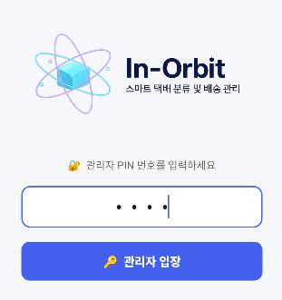
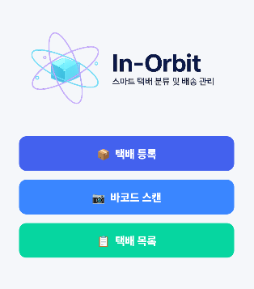
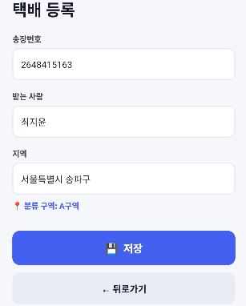
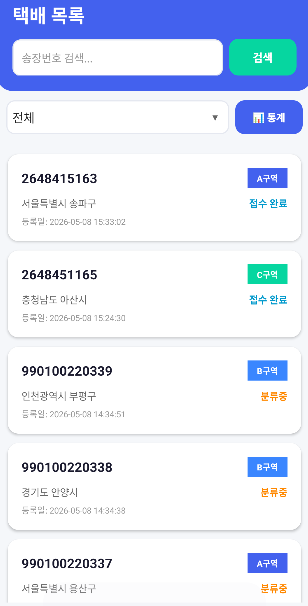
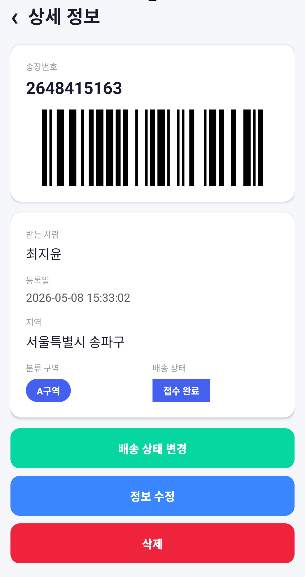
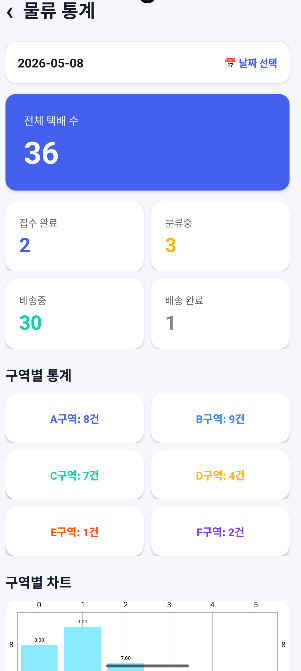
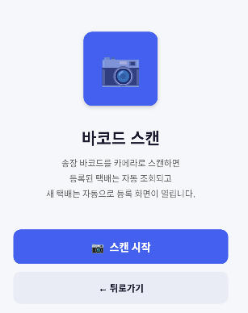

---

## 🔄 시스템 흐름
1. 관리자 PIN 인증 후 시스템 접근  
2. 택배 등록 및 정보 저장  
3. 바코드 자동 생성 및 데이터 등록  
4. 택배 목록 및 상태 조회  
5. 바코드 스캔을 통한 택배 조회  
6. 배송 상태 변경 및 구역 분류 처리  
7. 통계 화면 기반 물류 현황 확인  

---

## 🛠 기술 스택

| 구분 | 내용 |
|------|------|
| Language | Kotlin |
| Database | SQLite |
| Barcode | ZXing |
| UI | RecyclerView, CardView |
| Platform | Android |
| IDE | Android Studio |

---

## 💡 주요 기능

### 🔐 관리자 인증 기능
- 관리자 PIN 번호 기반 시스템 접근 제어
- 인증 후 메인 시스템 진입 처리

### 📦 택배 등록 기능
- 송장번호 및 수령인 정보 등록
- 지역 기반 자동 분류 구역 지정
- 등록일 자동 저장 기능 구현

### 📷 바코드 기능
- 송장번호 기반 바코드 자동 생성
- ZXing 기반 바코드 스캔 기능 구현
- 스캔 결과 기반 상세 정보 조회 처리

### 📋 택배 목록 및 상세 조회
- RecyclerView 기반 택배 목록 출력
- 상태 및 구역별 정보 표시
- 상세 정보 화면 기반 데이터 조회
- 배송 상태 수정 및 삭제 기능 구현

### 📊 물류 통계 기능
- 전체 택배 수 및 상태별 통계 표시
- 구역별 물류 데이터 분석 기능
- 날짜 기반 통계 조회 기능 구현

---

## 👨‍💻 구현 내용
- Kotlin 기반 Android 물류 관리 앱 구현
- SQLite 기반 택배 데이터 저장 및 조회 처리
- RecyclerView 기반 목록 UI 구성
- ZXing 기반 바코드 생성 및 스캔 기능 구현
- 배송 상태 관리 및 구역 분류 기능 구현
- 통계 Dashboard 화면 구성
- CardView 기반 UI 및 상세 화면 구성
- 날짜 및 상태 기반 데이터 필터 처리 구현

---

## ⚙️ 문제 해결 경험

### 📦 택배 상태 데이터 관리 문제
- 배송 상태 변경 시 목록과 상세 정보 간 데이터 불일치 문제가 발생
- SQLite 데이터 갱신 후 RecyclerView를 즉시 갱신하도록 처리하여 해결

### 📷 바코드 조회 처리 문제
- 스캔 결과와 저장된 송장번호 비교 과정에서 조회 실패 문제가 발생
- 송장번호 기반 검색 로직을 수정하여 정확한 조회 처리 구현

### 📊 통계 데이터 처리 문제
- 상태별 및 구역별 통계 계산 과정에서 데이터 반영 지연 문제가 발생
- 데이터 조회 시점에 실시간 계산하도록 구조를 개선하여 해결

---

## 🧠 설계 포인트
- SQLite 기반 로컬 데이터 관리 구조 설계
- 바코드 기반 택배 조회 흐름 구성
- 상태 및 구역 기반 물류 관리 구조 설계
- RecyclerView 기반 동적 목록 처리 구조 구성
- Dashboard 기반 통계 시각화 구성

---

## 🚀 프로젝트 특징
- 바코드 생성과 스캔 기능을 함께 구현한 물류 관리 시스템
- SQLite 기반 로컬 데이터 저장 구조 구현
- 상태 관리 및 구역 분류 기능 기반 물류 흐름 구성
- 통계 Dashboard 기반 물류 데이터 시각화 구현
- Android UI 기반 모바일 물류 관리 시스템 구현

---

## 📈 구현 결과 및 효과
- 택배 등록부터 조회, 상태 변경, 통계 확인까지 하나의 시스템으로 통합 구현
- 바코드 기반 빠른 조회 및 관리 기능 구현
- 상태별 및 구역별 물류 데이터 관리 가능
- 실시간 데이터 기반 통계 확인 기능 구현

---

## 🎥 시연 영상
시연 영상은 추후 업로드 예정입니다.

---

## 📷 실행 화면

### 🔐 관리자 인증 화면
관리자 PIN 번호 인증 후 시스템에 접근할 수 있도록 구현한 화면입니다.  

---

### 📦 메인 화면
택배 등록, 바코드 스캔, 택배 목록 기능으로 이동할 수 있는 메인 화면입니다.  

---

### 📝 택배 등록 화면
송장번호, 수령인, 지역 정보를 입력하여 택배를 등록하는 화면입니다.  

---

### 📋 택배 목록 화면
등록된 택배 목록과 상태 및 구역 정보를 확인할 수 있는 화면입니다.  

---

### 📄 상세 정보 화면
택배 상세 정보와 바코드 및 배송 상태를 확인할 수 있는 화면입니다.  

---

### 📊 물류 통계 화면
상태별 및 구역별 물류 통계를 확인할 수 있는 Dashboard 화면입니다.  

---

### 📷 바코드 스캔 화면
카메라를 통해 바코드를 스캔하고 택배 정보를 조회하는 화면입니다.  

